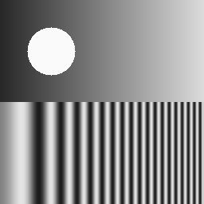
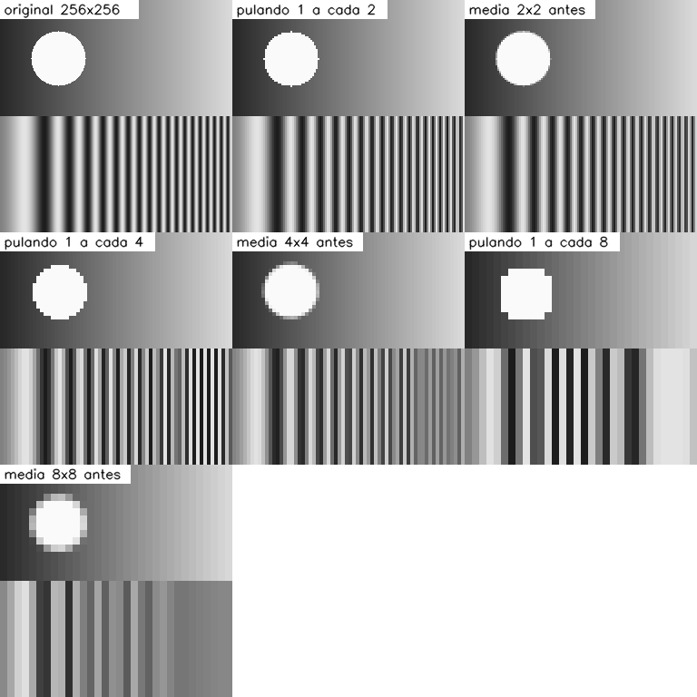
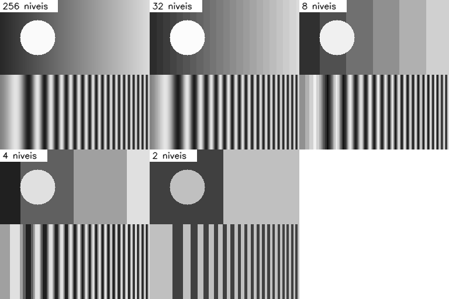
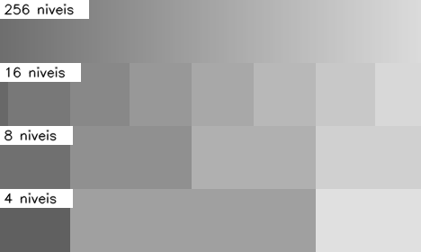

# Amostragem e quantização: o que sobra quando eu jogo pixels fora

*25/09/2026*

Toda imagem digital passou por duas simplificações: foi **amostrada** (a cena
contínua virou uma grade de pixels) e **quantizada** (a intensidade virou um
número inteiro de poucos bits). Neste post eu quis ver na prática o que
acontece quando aperto essas duas coisas: menos pixels de um lado, menos níveis
de cinza do outro.

## A pergunta

Se eu reduzir a resolução ou o número de níveis, o que se perde primeiro? E
existe um jeito de reduzir a resolução que estraga menos?

## O teste

Criei uma imagem de 256x256 em Python com duas metades de propósito:

- em cima, um degradê suave e um círculo branco (bom para ver os níveis de cinza);
- embaixo, listras cuja frequência **cresce da esquerda para a direita** (bom
  para ver o que acontece quando a grade de pixels não dá conta dos detalhes).

Código completo: [`codigo/amostragem_quantizacao.py`](codigo/amostragem_quantizacao.py).



## Como implementei

Para reduzir a resolução por um fator `k`, testei dois jeitos:

```python
def reduzir_pulando(img, k):      # fica com 1 pixel a cada k
    return img[::k, ::k]

def reduzir_media(img, k):        # média de cada bloco k x k
    h, w = img.shape
    return img.reshape(h // k, k, w // k, k).mean(axis=(1, 3)).round().astype(np.uint8)
```

Para quantizar, divido a faixa 0 a 255 em `niveis` faixas iguais e uso o valor
central de cada faixa:

```python
def quantizar(img, niveis):
    passo = 256 / niveis
    return (np.floor(img / passo) * passo + passo / 2).astype(np.uint8)
```

Depois de reduzir, amplio de volta ao tamanho original repetindo pixels, só
para poder comparar lado a lado e calcular o PSNR contra a imagem original.

## Resultados

### Resolução



| Fator | Pulando pixels | Média do bloco antes |
|---|---|---|
| 2 | 22,52 dB | 25,52 dB |
| 4 | 14,55 dB | 18,77 dB |
| 8 | 11,61 dB | 15,68 dB |

Pulando pixels, as listras da direita viram outro padrão: com fator 4 já
aparecem listras grossas em lugares onde a original tinha listras finas. Isso é
**aliasing**: não é só perda de detalhe, é um padrão que não existia. Fazendo a
média do bloco antes de reduzir, as listras finas somem num cinza liso, o que é
menos enganoso, e o PSNR também ficou melhor nos três fatores.

### Níveis de cinza



| Níveis | PSNR |
|---|---|
| 32 | 40,89 dB |
| 8 | 28,51 dB |
| 4 | 22,79 dB |
| 2 | 17,54 dB |

Com 32 níveis eu não noto diferença a olho nu. O problema aparece no degradê:
com poucos níveis ele vira degraus visíveis, os **falsos contornos**. Para
enxergar melhor, recortei só a faixa do degradê:



## O que dá para concluir

- Reduzir resolução sem filtrar antes gera padrões que não existem na imagem
  original. A média do bloco antes de descartar pixels custa pouco e evita boa
  parte disso.
- Perder níveis de cinza dói pouco até uns 32 níveis. Abaixo de 8, o degradê
  vira degrau.
- Os dois efeitos atacam regiões diferentes: resolução ataca o que é fino e
  repetitivo, quantização ataca o que é liso e gradual.

## Limites do teste

Usei uma imagem sintética, feita para exagerar os problemas. Numa foto real o
aliasing costuma ser menos dramático. O PSNR também não mede bem como uma
pessoa enxerga o resultado: os falsos contornos incomodam mais do que o número
sugere.

## Referências

- GONZALEZ, R. C.; WOODS, R. E. *Processamento Digital de Imagens*. 3. ed. São
  Paulo: Pearson, 2010. Capítulo 2, seção sobre amostragem e quantização.
- NumPy. *Array manipulation routines*. https://numpy.org/doc/stable/reference/routines.array-manipulation.html

---

[Voltar à página inicial](index.html)
