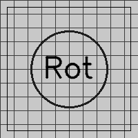
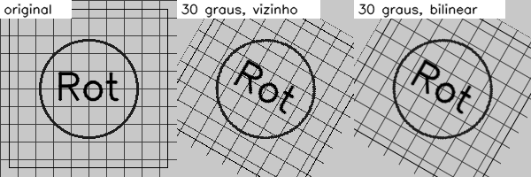
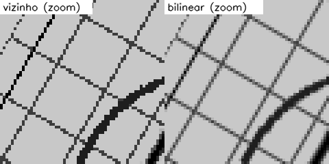
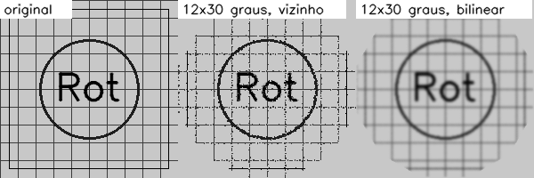

# Rotacionar uma imagem: vizinho mais próximo ou bilinear?

*29/09/2026*

Girar uma imagem parece simples, mas o pixel que cai numa posição fracionária
não tem valor definido. Para decidir a cor dele é preciso **interpolar**, e
existe mais de um jeito de fazer isso. Implementei dois e fiz um teste de
esforço: girar a mesma imagem várias vezes seguidas.

## A pergunta

Qual interpolação estraga menos a imagem: vizinho mais próximo ou bilinear? E o
que acontece quando as rotações se acumulam?

## O teste

Imagem de 200x200 feita em Python: fundo claro, uma grade de linhas finas, um
círculo, um texto e uma moldura. Linhas de 1 pixel são um bom teste porque
qualquer interpolação que borre ou quebre linha fica evidente.

Código completo: [`codigo/rotacao_interpolacao.py`](codigo/rotacao_interpolacao.py).



## Como implementei

Usei **mapeamento inverso**. Se eu percorresse a imagem de entrada e jogasse
cada pixel para a posição girada, sobrariam buracos na saída. Então faço o
contrário: para cada pixel da saída, giro a coordenada para o lado oposto e
descubro de onde ele veio na entrada.

```python
xs = c * (x - cx) + s * (y - cy) + cx     # rotação inversa em torno do centro
ys = -s * (x - cx) + c * (y - cy) + cy
```

Com `(xs, ys)` em mãos, os dois métodos diferem no que fazem com a parte
fracionária:

- **vizinho mais próximo:** arredonda `xs` e `ys` e copia aquele pixel;
- **bilinear:** mistura os 4 pixels em volta, com peso proporcional à proximidade.

```python
x0, y0 = np.floor(xs).astype(int), np.floor(ys).astype(int)
fx, fy = xs - x0, ys - y0
v = (f[y0, x0] * (1 - fx) * (1 - fy) + f[y0, x0 + 1] * fx * (1 - fy)
     + f[y0 + 1, x0] * (1 - fx) * fy + f[y0 + 1, x0 + 1] * fx * fy)
```

Comparei minha versão bilinear com `cv2.warpAffine`: 187 de 40 mil pixels
diferem em mais de 3 níveis de cinza (PSNR de 33,4 dB), todos no contorno da
área girada, onde o OpenCV trata a borda de outro jeito. No miolo o resultado é
o mesmo.

## Resultados

### Uma rotação de 30°



Ampliando um pedaço da imagem:



O vizinho mais próximo deixa as linhas com **degraus** (serrilhado) e às vezes
com espessura irregular. O bilinear deixa as linhas lisas, só que um pouco mais
moles.

### Doze rotações de 30° (volta completa)

Girando 12 vezes seguidas 30°, a imagem deveria voltar ao ponto de partida. Não
volta, porque a cada rotação os pixels são reamostrados.



| Método | PSNR do miolo contra a original |
|---|---|
| Vizinho mais próximo | 18,98 dB |
| Bilinear | 16,09 dB |

Esse resultado foi o contrário do que eu esperava: pelo PSNR, o vizinho foi
**melhor**. Olhando a figura dá para entender. O vizinho manteve as linhas
finas (quebradas, mas na posição certa), enquanto o bilinear borrou tudo: a
cada passada as linhas ficam mais largas e mais claras. O PSNR castiga mais
essa perda de contraste do que os pontos que ficaram falhados. Só que a
imagem do vizinho parece "suja" e a do bilinear "desbotada", e qual é pior
depende do que eu quero preservar.

## O que dá para concluir

- Numa rotação só, o bilinear parece melhor, como eu esperava.
- Em rotações acumuladas o bilinear perde nitidez a cada passo. Então o
  melhor é combinar as transformações numa matriz só e reamostrar **uma vez**.
- O PSNR sozinho enganou aqui. Preciso olhar a imagem também.

## Limites do teste

Girei sempre em torno do centro e só testei 30°. Múltiplos de 90° são um caso
especial (nem precisam de interpolação). Não testei bicúbica, que seria o
próximo passo.

## Referências

- GONZALEZ, R. C.; WOODS, R. E. *Processamento Digital de Imagens*. 3. ed. São
  Paulo: Pearson, 2010. Capítulo 2 (interpolação) e capítulo 3 (transformações
  espaciais).
- OpenCV. *Geometric Transformations of Images*. https://docs.opencv.org/4.x/da/d6e/tutorial_py_geometric_transformations.html

---

[Voltar à página inicial](index.html)
