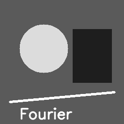
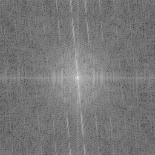
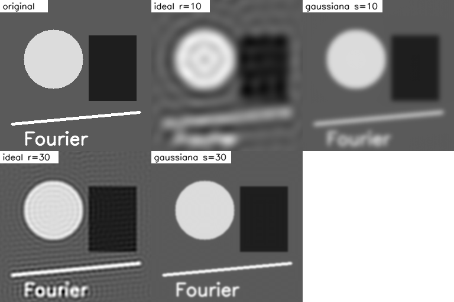
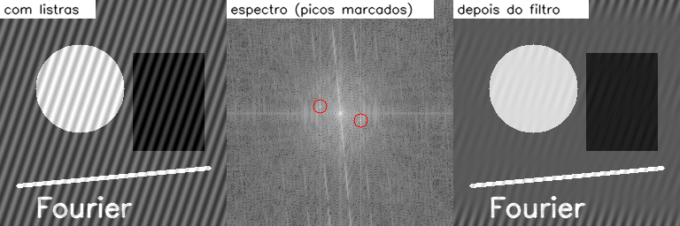

# Olhando uma imagem pelo espectro de Fourier

*13/10/2026*

Até aqui eu sempre tratei a imagem como uma grade de pixels. A transformada de
Fourier propõe olhar a mesma imagem como uma soma de ondas de várias
frequências: variação lenta é frequência baixa, detalhe fino e bordas são
frequência alta. Neste post eu usei isso para fazer duas coisas: um filtro
passa-baixa e a remoção de listras periódicas.

## A pergunta

O que o espectro de uma imagem mostra, e dá para limpar uma imagem só mexendo
no espectro?

## O teste

Imagem 256x256 feita em Python: fundo cinza, um círculo, um retângulo escuro,
uma linha e o texto "Fourier". Depois criei uma segunda versão somando uma
onda senoidal (listras diagonais) à imagem.

Código completo: [`codigo/fourier_2d.py`](codigo/fourier_2d.py).



## Como implementei

O NumPy já tem a FFT 2D, então a parte que escrevi foi o entorno: centralizar,
visualizar e aplicar as máscaras.

```python
def espectro(img):
    return np.fft.fftshift(np.fft.fft2(img.astype(np.float64)))

def para_imagem(F):
    return np.clip(np.real(np.fft.ifft2(np.fft.ifftshift(F))), 0, 255).astype(np.uint8)

def visualizar(F):                       # escala logarítmica, senão só o centro aparece
    m = np.log1p(np.abs(F))
    return (255 * m / m.max()).astype(np.uint8)
```

O `fftshift` leva a frequência zero para o centro da imagem. Fazendo a ida e a
volta sem nenhum filtro, a diferença máxima para a original foi de 1 nível de
cinza (arredondamento).

Espectro da imagem de teste:



O centro é a média de brilho e as frequências crescem para fora. Os riscos em
cruz vêm das bordas retas do retângulo e da linha.

## Resultados

### Passa-baixa: cortar as frequências altas

Testei dois filtros no espectro: o **ideal** (zera tudo fora de um raio `r`) e o
**gaussiano** (atenua suavemente).



| Raio / sigma | Ideal | Gaussiana |
|---|---|---|
| 10 | 20,32 dB | 21,39 dB |
| 30 | 25,03 dB | 26,91 dB |

O filtro ideal deixa **ondulações** em volta das bordas (efeito de anel,
*ringing*). Faz sentido: cortar o espectro de forma brusca equivale, no espaço,
a convoluir com uma função que oscila. A gaussiana não tem esse problema e teve
PSNR maior nos dois casos.

Conferi também que a gaussiana no domínio da frequência é o mesmo que um
borrão gaussiano comum: comparando com `cv2.GaussianBlur` (sigma 2 no espaço),
a diferença máxima foi de 2 níveis de cinza (PSNR de 51,5 dB). É o teorema da
convolução funcionando: convolução no espaço é multiplicação na frequência.

### Remover listras periódicas

Com as listras somadas, o espectro ganha dois pontos brilhantes isolados,
simétricos em relação ao centro:



Procurei o pico mais forte fora da região central: ele apareceu em
`(u, v) = (-23, -8)`, e o simétrico é `(23, 8)`. Eu tinha criado as listras com
frequência 0,09 e 0,03 ciclos por pixel, que multiplicadas por 256 dão cerca
de `(23, 8)`, então o pico está onde deveria. Zerei uma janela 5x5 em volta dos
dois picos e voltei para a imagem:

| | PSNR |
|---|---|
| Com listras | 20,40 dB |
| Depois de zerar os picos | 31,46 dB |

As listras praticamente sumiram, e o resto da imagem ficou intacto. Ainda dá
para ver um resto bem fraco de ondulação (visível na figura), porque a janela
que zerei é pequena e as listras não caem exatamente em um único ponto do
espectro.

## O que dá para concluir

- Ruído periódico é difícil de tirar no espaço, mas no espectro ele vira
  poucos pontos, fáceis de achar e remover.
- Filtro com corte brusco gera anel. Vale trocar por uma curva suave.
- Filtrar no espaço com kernel e filtrar no espectro com máscara são o mesmo
  processo visto de dois lados.

## Limites do teste

Achei o pico de forma automática só porque eu sabia que havia um par de listras
dominante. Com várias frequências ou ruído mais complicado, a seleção teria que
ser manual. Também não medi tempo de execução, então não sei se a FFT compensa
frente à convolução direta para kernels pequenos.

## Referências

- GONZALEZ, R. C.; WOODS, R. E. *Processamento Digital de Imagens*. 3. ed. São
  Paulo: Pearson, 2010. Capítulo 4 (filtragem no domínio da frequência).
- NumPy. *Discrete Fourier Transform (numpy.fft)*. https://numpy.org/doc/stable/reference/routines.fft.html

---

[Voltar à página inicial](index.html)
