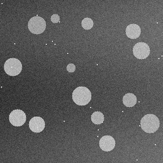
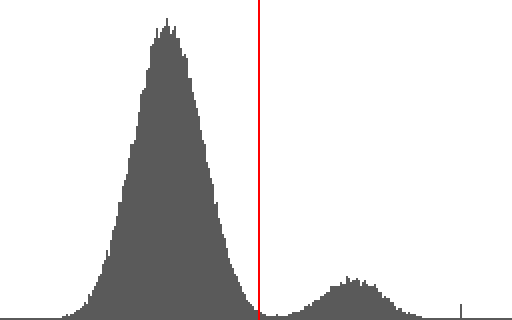
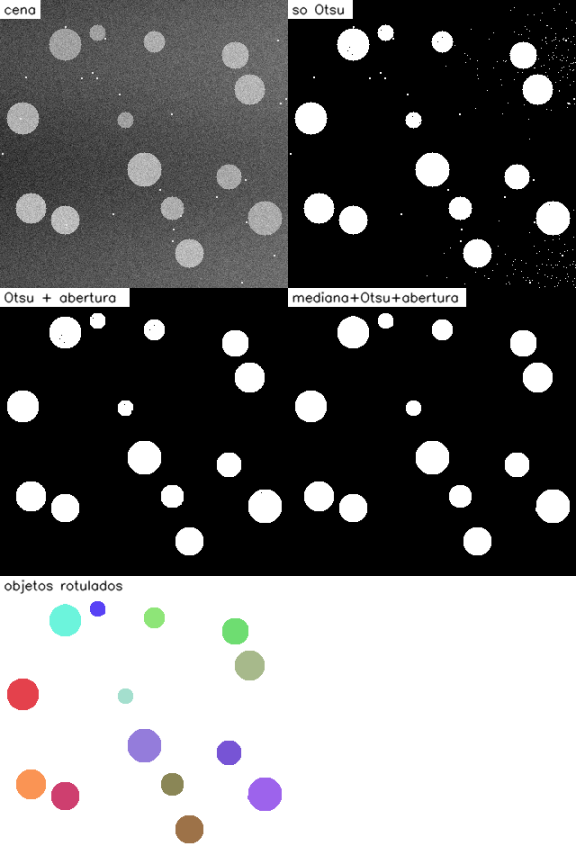

# Contando objetos: limiar de Otsu, morfologia e componentes conexos

*27/10/2026*

Neste post o problema é pequeno e concreto: dada uma imagem com vários objetos
claros sobre um fundo escuro, quantos objetos existem? Dá para responder com
um limiar, uma limpeza da imagem binária e a contagem das regiões conectadas.

## A pergunta

Um limiar automático (Otsu) já basta para contar, ou preciso de mais etapas? E
até que nível de ruído o método aguenta?

## O teste

Gerei cenas de 320x320 com 14 discos claros de tamanhos e brilhos diferentes,
sem encostar um no outro. O fundo tem iluminação irregular (fica mais claro
para a direita), há ruído gaussiano e espalhei 25 pontinhos de sujeira que não
são objetos. Como eu gero a cena, sei a resposta certa: 14.

Código completo: [`codigo/contagem_objetos.py`](codigo/contagem_objetos.py).



## Como implementei

Escrevi as três etapas na mão. O OpenCV só entrou para conferir o limiar.

Primeiro, o limiar de Otsu. Ele testa todos os limiares possíveis e escolhe o que
maximiza a variância entre as duas classes (fundo e objeto), usando o
histograma acumulado:

```python
def otsu(img):
    hist = np.bincount(img.ravel(), minlength=256).astype(np.float64)
    p = hist / hist.sum()
    w0 = np.cumsum(p)                        # peso da classe escura
    mu = np.cumsum(p * np.arange(256))
    var_entre = (mu[-1] * w0 - mu) ** 2 / (w0 * (1 - w0))
    return int(np.nanargmax(var_entre))
```

Nas 5 cenas, meu limiar deu o mesmo valor que o `cv2.threshold` com Otsu
(entre 125 e 129).



Depois, a abertura morfológica: erosão seguida de dilatação com janela 3x3. A
erosão apaga estruturas menores que a janela (pontos isolados), e a dilatação
devolve o tamanho aos objetos que sobraram.

```python
def abertura(b, k=1):
    return dilatar(erodir(b, k), k)
```

Por fim, os componentes conexos, com busca em largura a partir de cada pixel branco
ainda não visitado, marcando todos os vizinhos (4 direções) com o mesmo rótulo.
O número de rótulos é a contagem.

## Resultados



Contagem em 5 cenas (14 objetos reais em todas):

| Cena | Só limiar | Limiar + abertura | Mediana + limiar + abertura |
|---|---|---|---|
| 0 | 238 | 14 | 14 |
| 1 | 299 | 14 | 14 |
| 2 | 340 | 14 | 14 |
| 3 | 418 | 14 | 14 |
| 4 | 484 | 14 | 14 |

Só o limiar contou centenas de "objetos", porque cada pontinho de ruído e de
sujeira vira uma região. A abertura sozinha já resolve isso.

A mediana antes do limiar não fez diferença nessas cenas, então testei
aumentando o ruído. Cada linha abaixo usa 20 cenas novas:

| Ruído (σ) | Acertos sem mediana | Acertos com mediana (5x5) |
|---|---|---|
| 12 | 20/20 | 20/20 |
| 25 | 1/20 | 20/20 |
| 35 | 0/20 | 8/20 |
| 45 | 0/20 | 0/20 |

Com ruído moderado (σ = 25) a mediana faz toda a diferença. Com σ = 35 ela ainda
ajuda, mas erra em mais da metade das cenas. Com σ = 45 nenhuma das duas
combinações acerta a contagem exata, embora o erro com mediana seja bem menor
(erro total de 159 objetos contra 1172 sem ela, somando as 20 cenas).

## Conclusões

O Otsu achou um bom limiar quando há dois grupos claros de intensidade, mas
não limpa nada sozinho, porque pixel de ruído continua sendo pixel. Quem
deixou a imagem contável foi a abertura. A mediana antes do limiar aumenta o
ruído que o método aguenta, mas não resolve tudo.

## Limites do teste

Os discos nunca encostam. Se dois objetos se tocarem, viram um só componente e
a contagem erra por baixo. Isso pede outra técnica (transformada de distância,
watershed), que não implementei. A iluminação irregular do teste é pequena; com
um gradiente maior, um limiar global falharia e seria preciso um limiar local.

## Referências

- OTSU, N. A threshold selection method from gray-level histograms. *IEEE
  Transactions on Systems, Man, and Cybernetics*, v. 9, n. 1, p. 62-66, 1979.
- GONZALEZ, R. C.; WOODS, R. E. *Processamento Digital de Imagens*. 3. ed. São
  Paulo: Pearson, 2010. Capítulo 9 (morfologia) e capítulo 10 (limiarização).
- OpenCV. *Image Thresholding*. https://docs.opencv.org/4.x/d7/d4d/tutorial_py_thresholding.html

---

[Voltar à página inicial](index.html)
